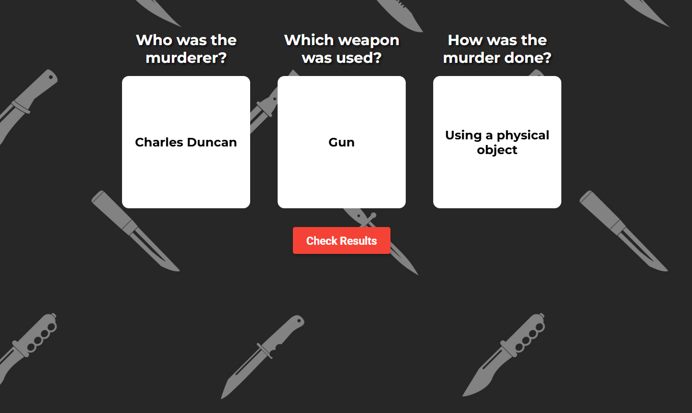

# Murder-Mystery-Website
A Python and JS Website that contains a murder mystery game with multiple stories and interactive UI for Gameplay

# Preview




---

## How It’s Made 

**Used:** HTML, CSS, JS, Python Flask  

* **Flask router** – `app.py` for three endpoints:  
  * `/` → serves the game shell (`index.html`)  
  * `/get_story_data/<story_id>` → JSON with locations, suspects, weapons, etc.  
  * `/complete_case` / `/get_completed_cases` → track solved cases in the session
* **Data-first design** – every story’s clues live in plain Python dicts (`static/data/*.py`), so adding a new case is simple
* **Front-end** – The JS builds an interactive “evidence board”: click a location & time, read the clue card, pick suspect / weapon / method, then hit **Check Results**

---

## Features

**Multiple locations** to view and piece together information
**Random shuffle** of suspects, weapons & methods 
**Card-style selections** for murderer, weapon & method |
**On-screen timer** so you can time yourself completing the cases

---

## Lessons Learned 

1. **Data-driven storytelling** → separating narrative text from logic which made content iteration painless
2. How to use Flask Python with JS

---


## Getting Started

```bash
# 1 – Clone
git clone https://github.com/Umar-Ansari-X/Murder-Mystery-Website.git
cd Murder-Mystery-Website

# 2 – Install Flask
pip install flask

# 3 – Run
python app.py
